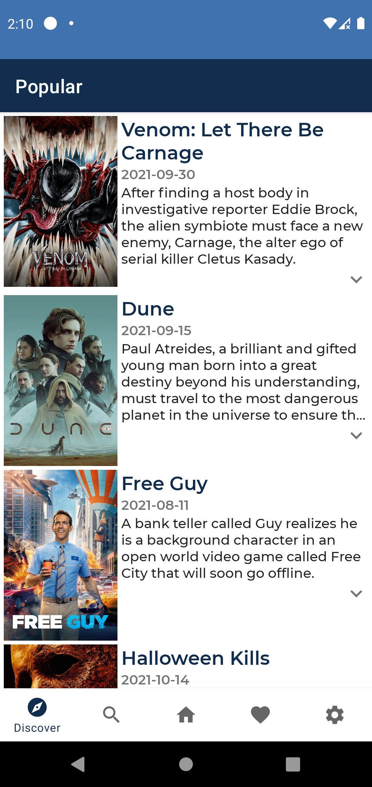

# Cinemobile
### Cinemobile is an android application that allows you to discover movies. There is a movie recommend bot. When you click it Cinemobile recommends you a movie. Also there is search support. The user can search any movies among thousand of movies.

## Features
- <a href="https://github.com/square/retrofit">Retrofit</a> -> to fetch movie datas from TMDB.
- <a href="https://developer.android.com/training/data-storage/room">Room</a> -> to save users favorite movies to local database.
- <a href="https://developer.android.com/topic/libraries/architecture/viewmodel">ViewModel</a> -> to hold live-data and flow datas.
- <a href="https://developer.android.com/topic/libraries/architecture/livedata">LiveData</a> -> to hold observable data.
- <a href="https://developer.android.com/kotlin/flow">Flow</a> -> to receive live updates from local and remote.
- <a href="https://developer.android.com/kotlin/coroutines">Coroitunes</a> -> to load datas asynchronously.
- <a href="https://developer.android.com/training/dependency-injection/hilt-android">Dagger-Hilt</a> -> to integrate dependency injection.
- <a href="https://developer.android.com/topic/libraries/view-binding">ViewBinding</a> -> to access and bind xml views.
- <a href="https://developer.android.com/guide/navigation">Navigation</a> -> to pass between fragments.
- <a href="https://developer.android.com/topic/libraries/architecture/paging/v3-overview">Paging</a> -> paging big movie lists.
- <a href="https://github.com/airbnb/lottie-android">Lottie</a> -> to load animations to get better ui.
- <a href="https://github.com/facebook/shimmer-android">ShimmerView</a> -> showing shimmer until load the datas.
- <a href="https://developers.google.com/admob/android/quick-start">Google-Ads</a> -> to load banner and interstitial ads.

## Screenshots
 

<pre><code>Copyright 2021 Ahmet Faruk Çuha</code></pre>
